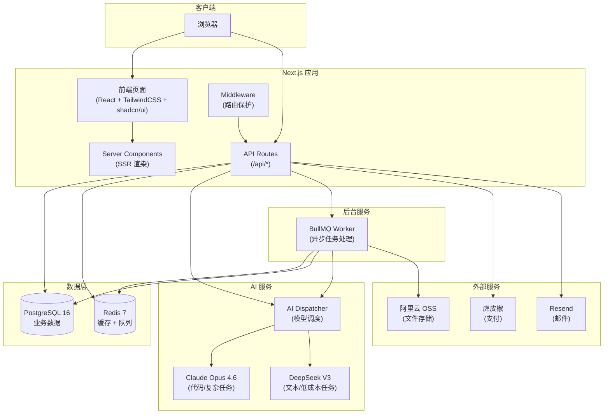
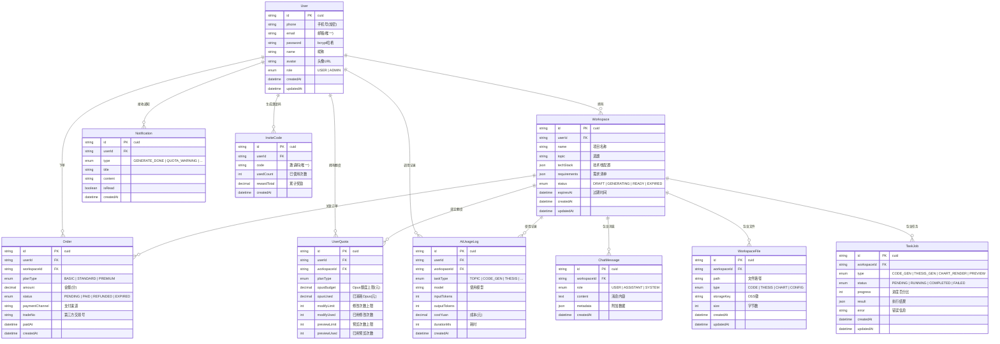
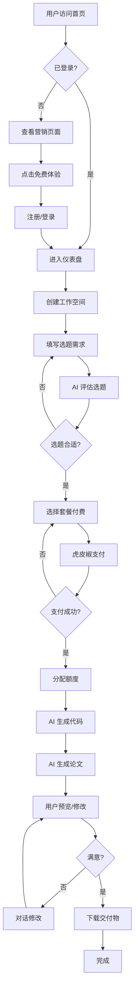
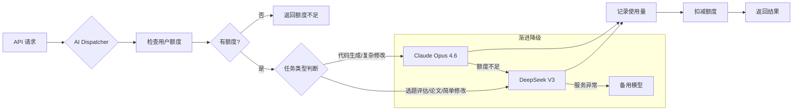
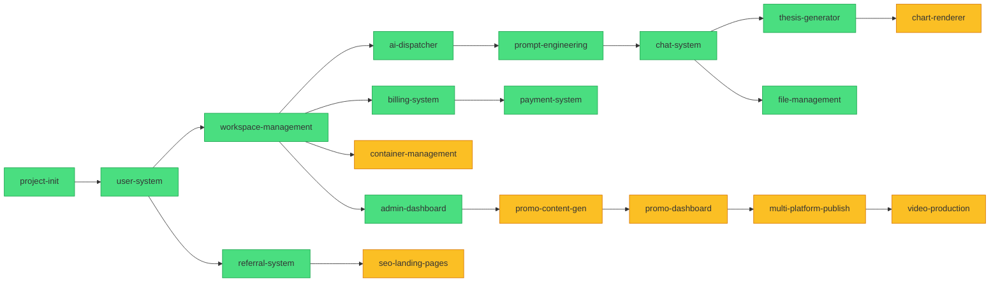

# 智码 ZhiMa — 系统图表

## 一、系统架构图

```mermaid
graph TB
    subgraph 客户端
        Browser[浏览器]
    end

    subgraph "Next.js 应用"
        direction TB
        Pages["前端页面<br/>(React + TailwindCSS + shadcn/ui)"]
        API["API Routes<br/>(/api/*)"]
        Middleware["Middleware<br/>(路由保护)"]
        SSR["Server Components<br/>(SSR 渲染)"]
    end

    subgraph "后台服务"
        Worker["BullMQ Worker<br/>(异步任务处理)"]
    end

    subgraph "AI 服务"
        Dispatcher["AI Dispatcher<br/>(模型调度)"]
        Claude["Claude Opus 4.6<br/>(代码/复杂任务)"]
        DeepSeek["DeepSeek V3<br/>(文本/低成本任务)"]
    end

    subgraph "数据层"
        PG[(PostgreSQL 16<br/>业务数据)]
        Redis[(Redis 7<br/>缓存 + 队列)]
    end

    subgraph "外部服务"
        OSS["阿里云 OSS<br/>(文件存储)"]
        HupiPay["虎皮椒<br/>(支付)"]
        Resend["Resend<br/>(邮件)"]
    end

    Browser --> Pages
    Browser --> API
    Pages --> SSR
    Middleware --> API
    API --> PG
    API --> Redis
    API --> Dispatcher
    API --> Worker
    Worker --> Redis
    Worker --> PG
    Worker --> Dispatcher
    Dispatcher --> Claude
    Dispatcher --> DeepSeek
    Worker --> OSS
    API --> HupiPay
    API --> Resend
```

## 二、数据库 ER 图

```mermaid
erDiagram
    User ||--o{ Workspace : "拥有"
    User ||--o{ Order : "下单"
    User ||--o{ UserQuota : "拥有额度"
    User ||--o{ AiUsageLog : "调用记录"
    User ||--o{ Notification : "接收通知"
    User ||--o{ InviteCode : "生成邀请码"

    Workspace ||--o{ Order : "关联订单"
    Workspace ||--o{ UserQuota : "绑定额度"
    Workspace ||--o{ AiUsageLog : "使用记录"
    Workspace ||--o{ ChatMessage : "包含消息"
    Workspace ||--o{ WorkspaceFile : "包含文件"
    Workspace ||--o{ TaskJob : "包含任务"

    User {
        string id PK "cuid"
        string phone "手机号(加密)"
        string email "邮箱(唯一)"
        string password "bcrypt哈希"
        string name "昵称"
        string avatar "头像URL"
        enum role "USER | ADMIN"
        datetime createdAt
        datetime updatedAt
    }

    Workspace {
        string id PK "cuid"
        string userId FK
        string name "项目名称"
        string topic "选题"
        json techStack "技术栈配置"
        json requirements "需求清单"
        enum status "DRAFT | GENERATING | READY | EXPIRED"
        datetime expiresAt "过期时间"
        datetime createdAt
        datetime updatedAt
    }

    Order {
        string id PK "cuid"
        string userId FK
        string workspaceId FK
        enum planType "BASIC | STANDARD | PREMIUM"
        decimal amount "金额(分)"
        enum status "PENDING | PAID | REFUNDED | EXPIRED"
        string paymentChannel "支付渠道"
        string tradeNo "第三方交易号"
        datetime paidAt
        datetime createdAt
    }

    UserQuota {
        string id PK "cuid"
        string userId FK
        string workspaceId FK
        enum planType
        decimal opusBudget "Opus额度上限(元)"
        decimal opusUsed "已消耗Opus(元)"
        int modifyLimit "修改次数上限"
        int modifyUsed "已用修改次数"
        int previewLimit "预览次数上限"
        int previewUsed "已用预览次数"
    }

    AiUsageLog {
        string id PK "cuid"
        string userId FK
        string workspaceId FK
        enum taskType "TOPIC | CODE_GEN | THESIS | ..."
        string model "使用模型"
        int inputTokens
        int outputTokens
        decimal costYuan "成本(元)"
        int durationMs "耗时"
        datetime createdAt
    }

    ChatMessage {
        string id PK "cuid"
        string workspaceId FK
        enum role "USER | ASSISTANT | SYSTEM"
        text content "消息内容"
        json metadata "附加数据"
        datetime createdAt
    }

    WorkspaceFile {
        string id PK "cuid"
        string workspaceId FK
        string path "文件路径"
        enum type "CODE | THESIS | CHART | CONFIG"
        string storageKey "OSS键"
        int size "字节数"
        datetime createdAt
        datetime updatedAt
    }

    Notification {
        string id PK "cuid"
        string userId FK
        enum type "GENERATE_DONE | QUOTA_WARNING | ..."
        string title
        string content
        boolean isRead
        datetime createdAt
    }

    InviteCode {
        string id PK "cuid"
        string userId FK
        string code "邀请码(唯一)"
        int usedCount "已使用次数"
        decimal rewardTotal "累计奖励"
        datetime createdAt
    }

    TaskJob {
        string id PK "cuid"
        string workspaceId FK
        enum type "CODE_GEN | THESIS_GEN | CHART_RENDER | PREVIEW"
        enum status "PENDING | RUNNING | COMPLETED | FAILED"
        int progress "进度百分比"
        json result "执行结果"
        string error "错误信息"
        datetime createdAt
        datetime updatedAt
    }
```

## 三、用户旅程流程图

```mermaid
flowchart TD
    A[用户访问首页] --> B{已登录?}
    B -- 否 --> C[查看营销页面]
    C --> D[点击免费体验]
    D --> E[注册/登录]
    B -- 是 --> F[进入仪表盘]
    E --> F

    F --> G[创建工作空间]
    G --> H[填写选题需求]
    H --> I[AI 评估选题]
    I --> J{选题合适?}
    J -- 否 --> H
    J -- 是 --> K[选择套餐付费]

    K --> L[虎皮椒支付]
    L --> M{支付成功?}
    M -- 否 --> K
    M -- 是 --> N[分配额度]

    N --> O[AI 生成代码]
    O --> P[AI 生成论文]
    P --> Q[用户预览/修改]
    Q --> R{满意?}
    R -- 否 --> S[对话修改]
    S --> Q
    R -- 是 --> T[下载交付物]
    T --> U[完成]
```

## 四、AI 调度流程图

```mermaid
flowchart LR
    Request[API 请求] --> Dispatcher{AI Dispatcher}

    Dispatcher --> Check[检查用户额度]
    Check --> HasQuota{有额度?}
    HasQuota -- 否 --> Reject[返回额度不足]

    HasQuota -- 是 --> Route{任务类型判断}

    Route -- "代码生成/复杂修改" --> Opus[Claude Opus 4.6]
    Route -- "选题评估/论文/简单修改" --> DS[DeepSeek V3]

    Opus --> Record[记录使用量]
    DS --> Record

    Record --> Deduct[扣减额度]
    Deduct --> Response[返回结果]

    subgraph 渐进降级
        Opus -- "额度不足" --> DS
        DS -- "服务异常" --> Fallback[备用模型]
    end
```

## 五、模块依赖关系图

```mermaid
graph LR
    PI[project-init] --> US[user-system]
    US --> WM[workspace-management]
    WM --> AD[ai-dispatcher]
    AD --> PE[prompt-engineering]
    PE --> CS[chat-system]
    WM --> BS[billing-system]
    BS --> PS[payment-system]
    CS --> TG[thesis-generator]
    CS --> FM[file-management]
    TG --> CR[chart-renderer]
    WM --> CM[container-management]
    US --> RS[referral-system]
    RS --> SL[seo-landing-pages]
    WM --> ADM[admin-dashboard]
    ADM --> PCG[promo-content-gen]
    PCG --> PD[promo-dashboard]
    PD --> MPP[multi-platform-publish]
    MPP --> VP[video-production]

    style PI fill:#4ade80,stroke:#16a34a
    style US fill:#4ade80,stroke:#16a34a
    style WM fill:#4ade80,stroke:#16a34a
    style AD fill:#4ade80,stroke:#16a34a
    style PE fill:#4ade80,stroke:#16a34a
    style CS fill:#4ade80,stroke:#16a34a
    style BS fill:#4ade80,stroke:#16a34a
    style PS fill:#4ade80,stroke:#16a34a
    style TG fill:#4ade80,stroke:#16a34a
    style FM fill:#4ade80,stroke:#16a34a
    style CR fill:#fbbf24,stroke:#d97706
    style CM fill:#fbbf24,stroke:#d97706
    style RS fill:#4ade80,stroke:#16a34a
    style SL fill:#fbbf24,stroke:#d97706
    style ADM fill:#4ade80,stroke:#16a34a
    style PCG fill:#fbbf24,stroke:#d97706
    style PD fill:#fbbf24,stroke:#d97706
    style MPP fill:#fbbf24,stroke:#d97706
    style VP fill:#fbbf24,stroke:#d97706
```

> 图例：🟢 已完成 | 🟡 进行中 | ⚪ 待开发
